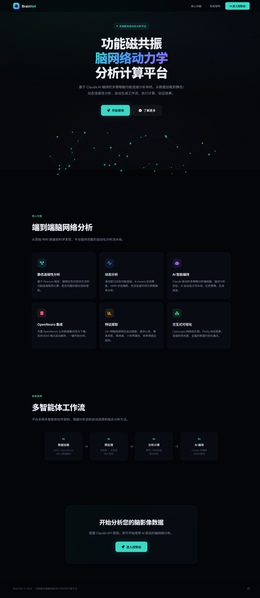
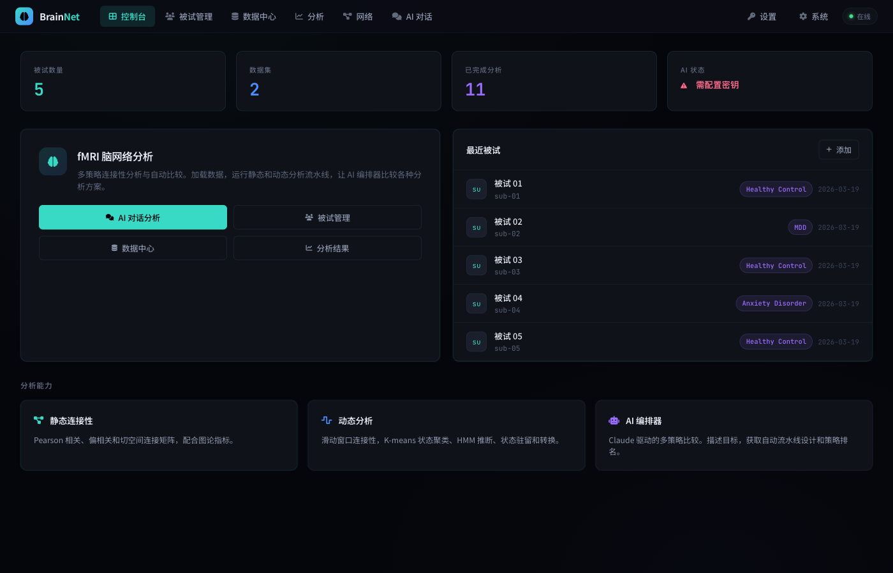
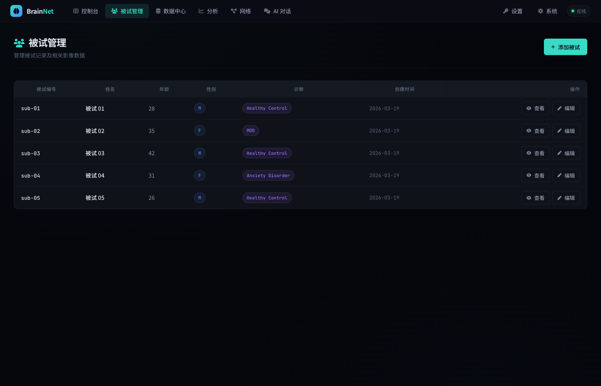
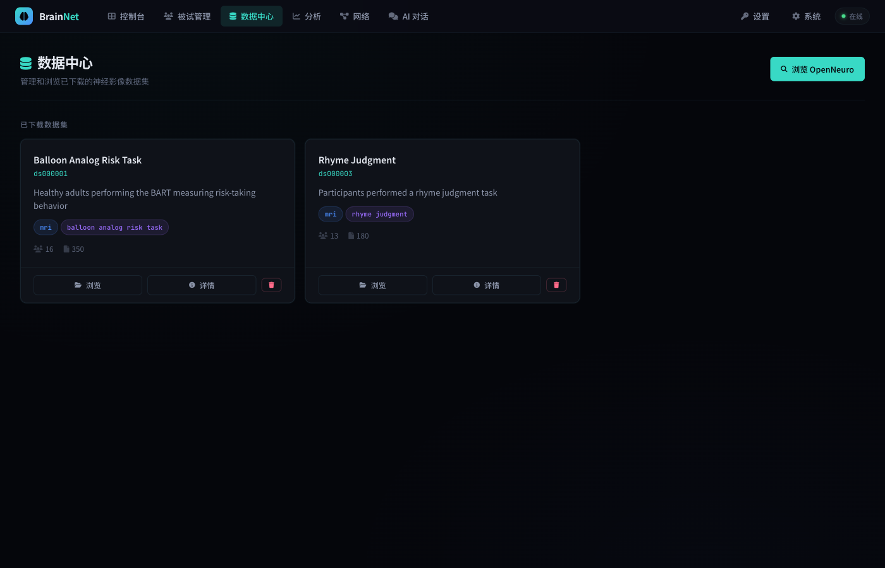
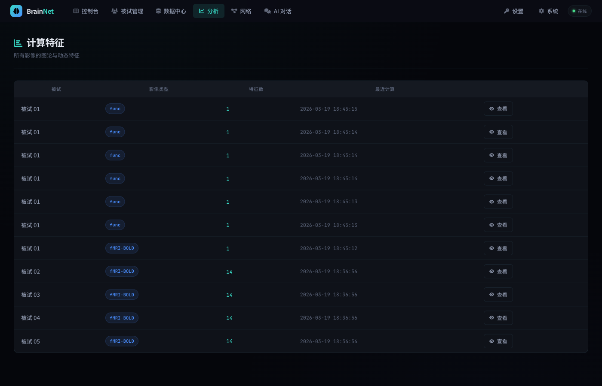
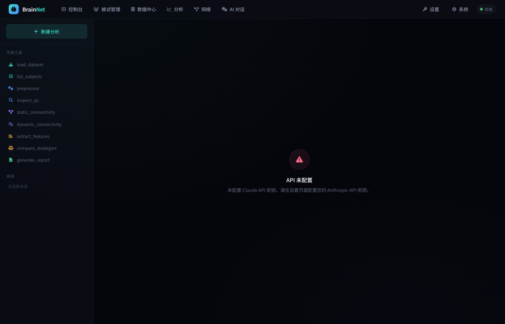
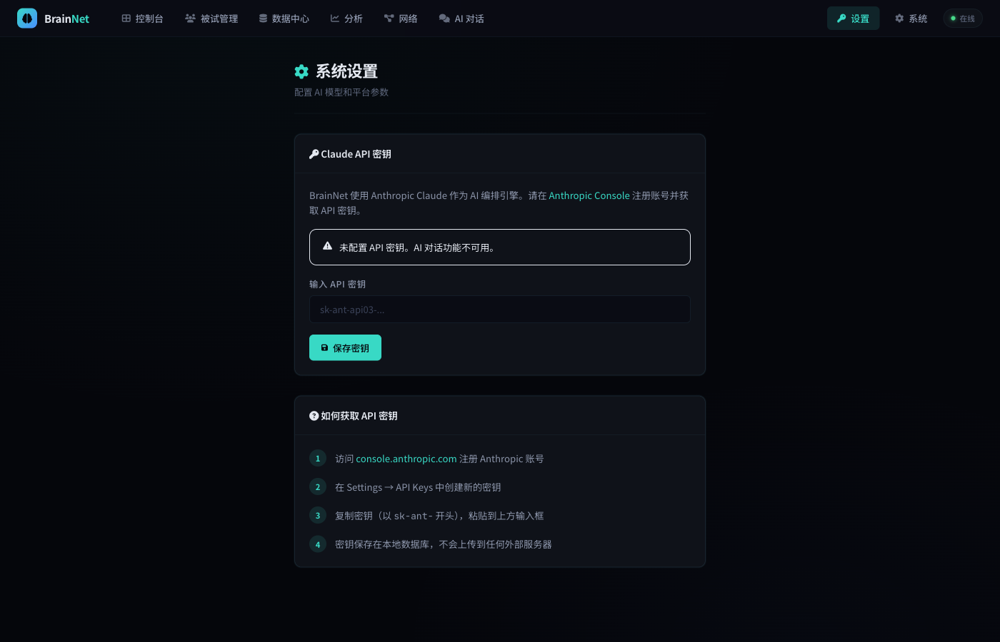

<div align="center">

# BrainNet

### 功能磁共振脑网络动力学分析计算平台

基于 Claude AI 编排的多策略 fMRI 脑功能连接分析系统

[](https://github.com/zxzok/brainnet/actions/workflows/ci.yml)


</div>

---



BrainNet 是一个面向神经影像科研人员的端到端 fMRI 脑网络分析平台。从数据获取、预处理、静态/动态功能连接分析到交互式可视化，提供完整的自动化工作流。平台内置深色科学主题全中文 Web 界面，集成 Claude AI 智能对话引擎。

## 快速开始

```bash
git clone https://github.com/zxzok/brainnet.git && cd brainnet
pip install -e .
python web_app.py
```

访问 `http://localhost:6525`，点击「进入控制台」开始使用。

---

## 控制台总览



控制台是平台的核心工作区，提供全局数据概览：

- **统计面板** — 被试数量、数据集、已完成分析、AI 状态一目了然
- **快捷入口** — AI 对话分析、被试管理、数据中心、分析结果快速跳转
- **最近被试** — 最新添加的被试及诊断信息，支持直接查看详情
- **分析能力卡片** — 静态连接性、动态分析、AI 编排器三大核心功能说明

---

## 被试管理

<table>
<tr>
<td width="55%">



</td>
<td width="45%">

### 完整的被试生命周期管理

- 被试编号自动关联 BIDS 格式（`sub-01` ~ `sub-N`）
- 记录年龄、性别、诊断等临床信息
- 支持添加、编辑、查看详情
- 被试详情页展示所有关联影像和分析结果
- 一键上传 MRI 影像并触发分析

</td>
</tr>
</table>

---

## 数据中心与 OpenNeuro 集成

<table>
<tr>
<td width="45%">

### 公共数据集一站式管理

- 内置 OpenNeuro 公共数据集搜索引擎
- 一键下载，后台异步执行
- 支持 BIDS 格式自动解析
- 数据集卡片展示模态、任务、被试数等元信息
- 下载完成后直接进入浏览和分析

</td>
<td width="55%">



</td>
</tr>
</table>

---

## 计算特征与分析结果



平台自动提取 **18+ 种脑网络特征**，涵盖静态图论指标和动态时间指标：

| 静态指标 | 动态指标 |
|---------|---------|
| Pearson 功能连接矩阵 | 滑动窗口动态连接 |
| 度中心性、介数中心性 | K-means 状态聚类 |
| 聚类系数、全局/局部效率 | HMM 状态推断 |
| 模块度、小世界属性 | 状态占用率、驻留时间 |
| 网络密度、平均路径长度 | 转移概率矩阵 |

特征详情页提供连接矩阵热图、动态状态时间线、占用率/驻留时间柱状图等交互式可视化。

---

## AI 智能对话

<table>
<tr>
<td width="55%">



</td>
<td width="45%">

### Claude 驱动的分析编排器

集成 Anthropic Claude 大语言模型，提供 **9 种内置工具**：

- `load_dataset` — 加载数据集
- `preprocess` — 执行预处理
- `static_connectivity` — 静态连接分析
- `dynamic_connectivity` — 动态连接分析
- `extract_features` — 特征提取
- `compare_strategies` — 多策略比较
- `generate_report` — 生成分析报告

用自然语言描述分析目标，AI 自动设计流水线、执行计算、比较方案。

</td>
</tr>
</table>

---

## 系统设置

<table>
<tr>
<td width="45%">

### 零环境变量配置

无需命令行设置环境变量，通过 Web 界面即可完成所有配置：

1. 访问 [console.anthropic.com](https://console.anthropic.com/) 获取 API 密钥
2. 在设置页面粘贴密钥并保存
3. 密钥加密存储在本地数据库，不上传外部服务器

支持随时更新或清除密钥。

</td>
<td width="55%">



</td>
</tr>
</table>

---

## 分析流水线

```
BIDS 数据集 / NIfTI 文件
        │
        ▼
┌─────────────────┐
│   数据索引       │  DatasetIndex：发现被试、会话、运行
└───────┬─────────┘
        ▼
┌─────────────────┐
│   预处理         │  空间平滑 → 时间滤波 → 去噪回归 → ROI 提取
└───────┬─────────┘
        ▼
┌─────────────────┐     ┌──────────────────────┐
│  静态连接分析    │     │  动态连接分析          │
│                 │     │                      │
│ Pearson 相关    │     │ 滑动窗口 + K-means    │
│   → 连接矩阵    │     │ 或 HMM / CAP         │
│   → 图论指标    │     │   → 状态序列          │
└───────┬─────────┘     └──────────┬───────────┘
        └────────────┬─────────────┘
                     ▼
           ┌──────────────────┐
           │  结果存储与可视化  │
           │                  │
           │ SQLite 特征数据库 │
           │ Plotly 交互图表   │
           │ Claude AI 解读   │
           └──────────────────┘
```

## 命令行工具

```bash
# 处理本地 BIDS 数据集
brainnet-cli /path/to/bids --subject 01 --task rest

# 从 OpenNeuro 下载并处理
brainnet-cli --openneuro-id ds000114 --subject 01 --task rest

# 查看分析计划（不执行）
brainnet-cli --describe-plan /path/to/bids --subject 01 --task rest
```

## 技术栈

| 层 | 技术 |
|---|------|
| Web 框架 | Flask + Jinja2 |
| 前端 | CSS 自定义属性设计系统 · Noto Sans SC · Plotly.js |
| 数据分析 | NumPy · SciPy · Pandas · scikit-learn · NetworkX |
| 神经影像 | nibabel · nilearn |
| AI 引擎 | Anthropic Claude (SSE 流式) |
| 数据源 | OpenNeuro GraphQL API |
| 测试 | pytest (47 tests) · ruff (lint) |
| CI/CD | GitHub Actions |

## 系统要求

- **Python** 3.10+
- **操作系统** Linux / macOS / Windows
- **可选外部工具** FSL / ANTs / SPM（仅高级预处理需要）

<details>
<summary>可选依赖</summary>

| 包 | 用途 |
|---|------|
| `hmmlearn` | 隐马尔可夫模型分析 |
| `plotly` | 交互式可视化报告 |
| `datalad` | 大文件断点续传下载 |
| `anthropic` | Claude AI 对话功能 |

</details>

## 许可证

本项目仅用于研究和教学目的。
